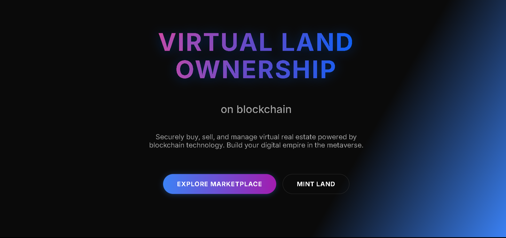
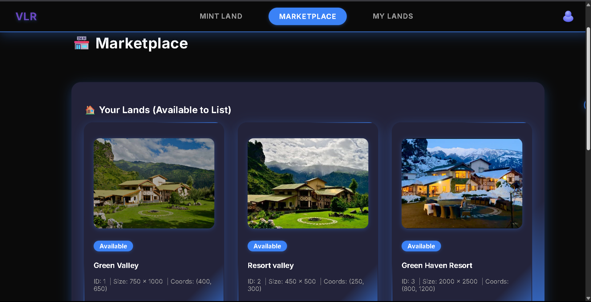

# 🌍 Virtual Land Registry

A next-generation decentralized platform for minting, trading, and managing virtual land assets on the Internet Computer. Experience a premium UI/UX, seamless authentication, and a robust marketplace—all powered by blockchain.

---

## 🚀 Features

- **Mint Virtual Land:** Create unique land NFTs with custom names, coordinates, and images.
- **Marketplace:** List, buy, and sell land NFTs in a secure, trustless environment.
- **My Lands:** View and manage your owned lands with beautiful, interactive cards.
- **Animated UI:** Smooth transitions, animated modals, and a magnetic cursor for a delightful user experience.
- **ICP Authentication:** Secure login with Internet Identity.
- **Blockchain Proof:** All land ownership and transactions are verifiable on-chain.
- **Responsive Design:** Works great on desktop and mobile.

---

## 🖼️ Screenshots

| Landing Page | My Lands | Marketplace | Mint Land |
|--------------|----------|-------------|-----------|
|  |  |  |  |

---

## 🌐 Live Demo

> _If deployed, add your live demo link here!_

[Live Demo](http://localhost:4943?canisterId={asset_canister_id})

---

## 🛠️ Tech Stack

- **Frontend:** React, Vite, Framer Motion, GSAP, SCSS
- **Backend:** Rust, Internet Computer Canisters
- **Blockchain:** DFINITY Internet Computer
- **Other:** ICP Identity, Canvas Confetti, Modern CSS

---

## 📦 Project Structure

```
virtual-land-registry/
├── src/
│   ├── backend/         # Rust canister code
│   ├── frontend/        # React frontend
│   │   ├── components/  # UI components
│   │   ├── hooks/       # Custom React hooks
│   │   ├── assets/      # Images, icons, etc.
│   │   ├── styles/      # SCSS/CSS files
│   │   └── ...          # More frontend code
│   └── declarations/    # Auto-generated canister bindings
├── dfx.json             # DFINITY config
├── package.json         # NPM config
├── Cargo.toml           # Rust config
└── README.md            # This file
```

---

## ⚡ Quick Start

### Prerequisites

- [Node.js](https://nodejs.org/) >= 16.x
- [DFINITY SDK (dfx)](https://internetcomputer.org/docs/current/developer-docs/setup/install)
- [Rust](https://www.rust-lang.org/tools/install)

### Local Development

```bash
# Install dependencies
npm install

# Start the local Internet Computer replica
dfx start --background

# Deploy canisters (backend + frontend)
dfx deploy

# Start the frontend dev server
cd src/frontend
npm start
```

- The app will be available at [http://localhost:8080](http://localhost:8080)
- The backend runs on the local replica at [http://localhost:4943](http://localhost:4943)

---

## 🏗️ Deployment

To deploy to the Internet Computer mainnet, update your `dfx.json` and follow the [DFINITY deployment guide](https://internetcomputer.org/docs/current/developer-docs/deploy/).

---

## 🤝 Contributing

Contributions are welcome! Please open issues and pull requests for new features, bug fixes, or improvements.

1. Fork the repo
2. Create your feature branch (`git checkout -b feature/your-feature`)
3. Commit your changes (`git commit -am 'Add new feature'`)
4. Push to the branch (`git push origin feature/your-feature`)
5. Open a pull request

---

## 📄 License

This project is licensed under the MIT License. See [LICENSE](LICENSE) for details.

---

## 🙏 Credits

- [DFINITY Foundation](https://dfinity.org/)
- [Framer Motion](https://www.framer.com/motion/)
- [GSAP](https://greensock.com/gsap/)
- [React](https://reactjs.org/)
- All contributors

---

> _Built with ❤️ for the decentralized future._
